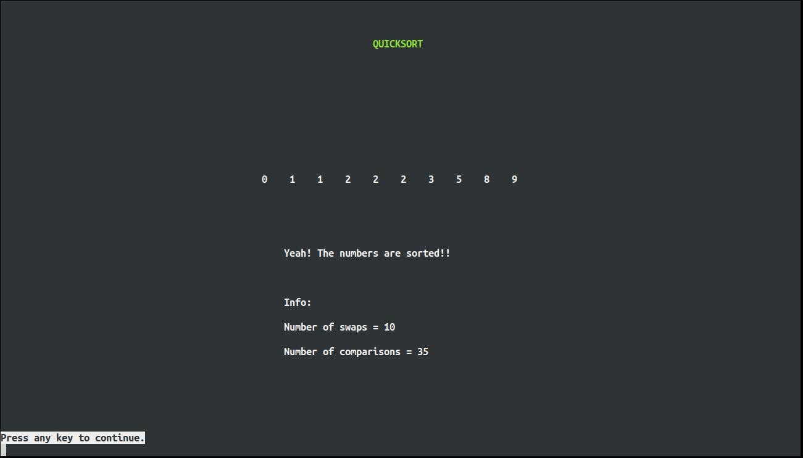

# Sorting Algorithm Animations

Animations of Bubble Sort, Quicksort and Selection Sort, written in C.  
`ncurses.h` library was used for GUI.

## Screens

## Requirements

**`ncurses.h`:**

`$ sudo apt-get install libncurses5-dev`

**[Optional] `ncurses.h` man pages:**

`$ sudo apt-get install ncurses-doc`

## Usage

`$ ./run.sh`
